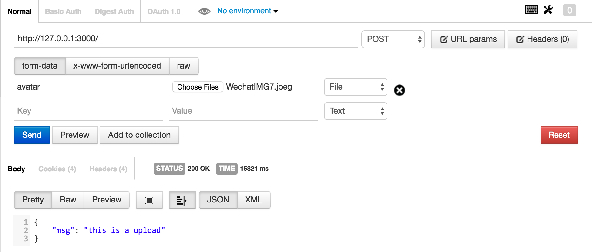

# Getting Start

这里是sletjs上传的示例

## 安装slet模块

```
$ npm i -S slet
$ npm i -S slet-uploadcontroller
```

## 从app.js开始

```
'use strict';

const Slet = require('slet');
const app = new Slet({
    root: __dirname,
    debug: true,
    upload: { dest: './uploads/'}
});

app.defineController(require('slet-uploadcontroller'))

app.router('/', require('./uploadctrl') )  

app.start(3000) 
```

注意：如果不配置upload选项，会报错的。
 
## 编写uploadctrl.js

```
'use strict';

const UploadController = require('slet').UploadController

module.exports = class MyUploadController extends UploadController {
  constructor(app, ctx, next) {
    super(app, ctx, next)
    
    this.post_filter = [this.upload.single('avatar')]
  }
  
  post() { 
    return {
      msg: 'this is a upload'
    }
  } 
}
```

这里使用了post_filter拦截器，具体参加文档。

这里使用的单一文件，更多方法参见

- https://github.com/expressjs/multer
- https://github.com/koa-modules/multer

## 启动server

最后，执行app.js，启动server

```
$ node app.js
```

## 查验结果

打开postman



